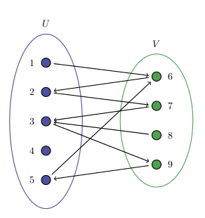

% L'algorithme d'Edmonds
% Jules Pondard, Joseph, Lucas
% 1er Janvier 2016

# Quel est le problème ?

## Rappel du problème

* Etant donné un graphe non orienté, on souhaite sélectionner un ensemble d'arêtes tel que :   
	* Cet ensemble soit le plus grand possible.   
	* Chaque noeud du graphe apparait au plus dans une arête de l'ensemble.
  La liste des arêtes d'un tel ensemble est appelée **couplage maximum**.

* ***L'objectif est de trouver un tel couplage en temps polynomial.***

## Cas particulier

On peut s'intéresser au problème du couplage maximum dans des graphes particuliers. 

### Exemple, graphe biparti  
- N personnes numérotées de 1 à N et N vélos numérotés de 1 à N. Chaque personne aime certains vélos : on donne pour chaque personne la liste des vélos qu'elle aime bien.   
- Est-il possible d'attribuer un vélo à chaque personne ?
- C'est le problème du *couplage maximum dans un graphe biparti*.

## Résolution particulière

On se donne la représentation suivante pour un graphe biparti.   
Les arêtes coloriées appartiennent au couplage.
<!---->
\center\includegraphics[height=4.5cm]{graphebiparti1.png}

Comment déterminer le couplage maximum ?

## Résolution particulière (2)

Quel que soit le couplage, il est maximum si et seulement si il n'existe pas de chemin augmentant.

\center\includegraphics[height=4.5cm]{graphebiparti_mixt.png}

## Résolution particulière (3)

On obtient donc l'algorithme suivant : 

### Algorithme de couplage dans un graphe biparti

~~~{.python .numberLines}
changement = VRAI
while (changement):
	changement = FAUX
	cheminAugmentant = trouveCheminAugmentant()
	if (cheminAugmentant != VIDE):
		prendreLeCheminAugmentant()
		changement = VRAI
~~~

# Généralisation
##

\center\includegraphics[height=6.5cm]{edmonds2.jpg}

## Idée générale de l'algorithme

### Résultat admis

Dans un graphe général, un couplage est maximum si et seulement si il n'existe pas de chemin augmentant.

Ceci nous conduit à l'idée suivante : 

. . .

***faire comme précédemment !***

## Problème : existence de cycles impairs

Pour trouver un chemin augmentant, on ne peut plus procéder exactement comme avant à cause de la présence de cycles impairs.

\center\includegraphics[height=5cm]{exemplefleur.png}

## Solution : la contraction de fleurs

Conformément au lemme admis dans le polycopié, on peut continuer à chercher un chemin augmentant sur le graphe contracté, dans lequel le cycle impair,
appelé fleur, a été fusionné en un seul noeud. C'est l'**algorithme d'Edmonds**.

### Remarques
* Le pseudo-code qui va suivre utilise un DFS (puisque l'ordre des arêtes à considérer dans le polycopié est arbitraire).
<!-- * Nous avons choisi l'ordre du DFS sur les arêtes en conservant l'algorithme décrit dans le sujet.
* Le pseudo-code qui va suivre diffère légèrement du code que nous avons écrit, pour faciliter la compréhension.
* Comme signalé dans le rapport, nous pensons que la fonction trouveCorolle n'a pas besoin d'être employée. -->

## Blossom Algorithm

### Fonctions principales
~~~{.python .numberLines}
  def dfs(G):
    pour chaque noeud i de G: 
      si i est non couplé
       && trouveCheminAugmentant(i, G) != VIDE:
        return chemin
  def main(G):
    tant que changement:
      chemin=dfs(G)
      si chemin != VIDE:
        applique chemin (xor)
~~~

## Blossom Algorithm (2)

### Pseudo-code de la fonction trouveCheminAugmentant

\lstinputlisting[language=python]{cheminAugm_p1.pseudo}

## Blossom Algorithm (3)

### Suite de la fonction trouveCheminAugmentant

\lstinputlisting[language=python]{cheminAugm_p2.pseudo}

## Analyse de la complexité

> - Soit V le nombres de noeuds, E le nombre d'arêtes.
> - A l'issue de l'examen des V noeuds lors du DFS implémenté par trouveCheminAugmentant, on obtient soit un chemin augmentant, soit une contraction,
soit l'algorithme est terminé.
> - Il ne peut y avoir que V contractions avant d'aboutir sur un chemin augmentant.
> - Il faut donc relancer V fois le DFS, chacun s'exécutant en temps E. => V * E
> - Au total, on ne peut trouver que V chemins augmentants. => V^2 * E
> - D'où une complexité de O(V^2*E).

# Notre implémentation

## Choix

> - Nous avons choisi l'ordre du DFS sur les arêtes en conservant l'algorithme décrit dans le sujet.
> - La variation principale est que l'on ne recommence pas tout à 0 lorsque l'on "contracte".
> - Comme signalé dans le rapport, nous pensons que la fonction trouveCorolle n'a pas besoin d'être employée.

## Structures et représentations

> - On parcourt les arêtes deux par deux, de sorte à ce que l'on se trouve toujours sur un noeud **pair**.
> - Le tableau "père" sert à remonter une arête sur le chemin courant, à partir d'un noeud sur lequel on est arrivés par une arête non-couplée.
	Il s'agit donc d'un noeud **impair**.
> - Le tableau repres sert à fusionner les fleurs.

## Détection de cycle impair : 

* Un cycle impair se détecte donc lorsque l'on regarde dans les voisins du noeud courant, si l'on trouve un noeud qui est
soit la source (tige triviale), soit un noeud dont le couplé a un père
	* En effet, le couplé est alors impair.
	* Donc le voisin est pair, mais aussi impair !

## La contraction de fleurs

> - L'astuce est la suivante : marquer tous les noeuds comme ayant le même représentant
> - Et décréter que chaque noeud de la corolle fait parti d'un chemin qui le relie à la base !
> - Cela implique de marquer les pères des noeuds "impairs" le long du chemin, de chacun des deux côtés.

. . . 

Ainsi, lorsque l'on va trouver un chemin augmentant, il sera très aisé d'en déduire le chemin sur le graphe "décontracté" !

## Complexité

> - La contraction ne relance pas le DFS à partir de 0.
> - Au sein d'un DFS chaque noeud est marqué au plus une fois.
> - D'où une complexité de O(V * E) = O(V^3) !

# Aspects techniques et difficultés

## Autour de la structure générale de l'algorithme

* Nous avons changé à plusieurs reprises d'avis concernant la manière la plus simple de représenter le graphe en mémoire.
	* Que ce soit pour les arêtes
	* Ou pour la façon dont on représente un couplage

. . .

* Nous ne savions pas vraiment quel était le format attendu pour permettre à l'utilisateur de tester chaque fonction.
	* Nous avons choisi de faire un main qui permet en rentrant un certain numéro de sélectionner la fonction à tester
	* Cela présente l'inconvénient de faire croire à une homogénéité des formats d'entrée.

## Autour de la structure générale de l'algorithme (suite)

* Il était écrit dans le sujet que l'on pouvait obtenir la complexité de V^3, où V est le nombre de noeuds.
	* Nous avons cherché à obtenir cette complexité
	* Tout en simplifiant la manière de coder l'algorithme
	
	. . .
	
	* L'algorithme qui en résulte est pour nous assez satisfaisant : 
		* Il est plus efficace en termes asymptotiques, O(V^3) au lieu de O(V^4).
		* Il épargne une vraie fusion des noeuds lors de la contraction des fleurs.

## Autour du langage C

L'un d'entre nous était déjà à l'aise avec le langage C et à sa bibliothèque standard.
Voici quelques points que nous avons été amenés à considérer.

. . .

* Il est nécessaire de passer par l'allocation dynamique pour représenter un graphe peu dense efficacement.
	* En effet, chaque noeud a un nombre variable d'arêtes. Si le graphe comporte 5N arêtes par exemple, 
	un noeud peut en posséder N et la plupart des autres 0. Il serait alors dommage de stocker N arêtes par noeud !
	* Nous avons, à cet effet, réimplémenté la structure de Vecteur étudiée en TD.

	. . .

		* Ce fut d'ailleurs une source de bugs...

. . .

## Autour du langage C (2)

* Nous avons regretté que le C ne permette pas de définir des fonctions dans ses structures.
  Il est désagréable de passer un pointeur sur l'objet à chaque fonction pour simuler un simple "obj->foo()".

. . .

* Le C n'est pas simple à débugger à la différence du langage OCaml. 
  Nous avons passé du temps à faire des backtrace sur GDB pour trouver un segfault !

## Autour de la variation de l'algorithme que nous avons introduite

* Pour une raison que nous ne comprenons pas bien, il est nécessaire dans notre code de remonter le chemin
de chacun des deux côtés lors de la détection d'une corolle pour trouver la base.   
Nous avons passé beaucoup de temps à débugger à cause de ce point.

# Tests et performances

## Un générateur de tests

## Des sites pour tester

## De beaux graphiques

# Conclusion

## Si nous avions eu plus de temps ...

## Des blocks spécifiques

\begin{alertblock}{Alerte}
Ceci est une alerte
\end{alertblock}

\begin{exampleblock}{Exemple}
Ceci est un exemple
\end{exampleblock}

